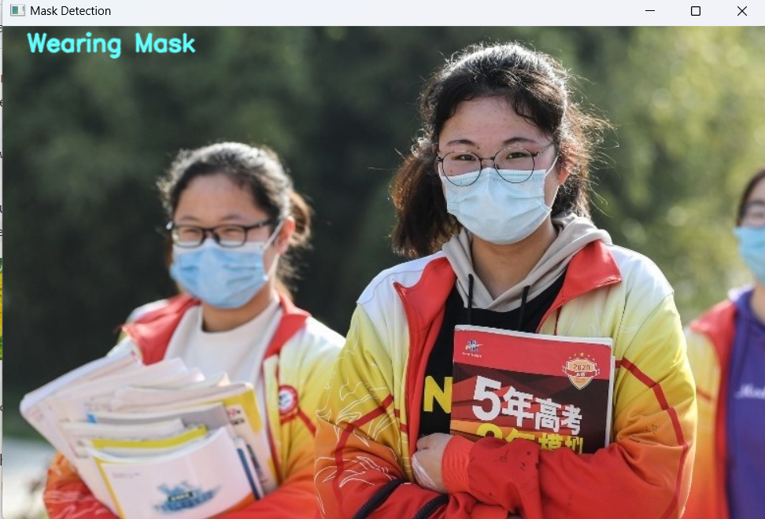

# Face-Mask-Detection
## Description

This project implements a facial mask detection system using classical computer vision approach with OpenCV and Haar cascades. Utilizing image input, the program identifies faces and mouths, providing a status on whether a person is wearing a mask or not. In scenarios where no faces are detected, the program issues a notification stating "No Face Detected." While effective in certain situations, the project has limitations in detecting variations in facial poses and mouth coverings. The success of this project demonstrates the potential of a simple solution to enhance awareness and compliance with mask usage.

## Installation

1.  Clone this repository to your local device using `git`:
    ```
    git clone https://github.com/widyamsib/Face-Mask-Detection.git
    ```
2.  Change your terminal into the new subdirectory:
    ```
    cd Face-Mask-Detection
    ```
3.  Then open in Visual Studio Code:
    ```
    code .
    ```
4.  If the Python requires a virtual environment, create and activate the virtual environment in the terminal
    ```
    python -m venv venv
    .\venv\Scripts\activate
    ```
5.  Install project depedencies using:
    ```
    pip install -r requirements.txt
    ```

## Testing
1.  Open the folder that containing the cloned of Github repository

2.  Run the following command in the terminal to load ```mask.py``` with input of images in the ```assets``` folder
    ```
    python mask.py assets/mask20.jpg
    ```

3.  The program output will be displayed on the screen.

    The input
    

    The Output
    

    ```
    Wearing Mask
    ```